# Mini OJ

## 项目简介

一个基于.net framework的Online Judge平台

用户可以根据问题在线提交程序多种程序源代码，系统对源代码进行编译和执行，并通过预先设计的测试数据来检验程序源代码的正确性。

本项目现支持C，C++，Java三种编程语言。

## 项目要求

本课程项目有如下要求，皆已完成要求

* [x] 系统至少有五个程序集
* [x] 需要系统进行模块划分 
* [x] 需要其中一个是共享程序集 
* [x] 采用 C++/CLI 实现一个程序集，给 C#使用 
* [x] 使用 C++实现一部分功能，输出成一个 Win32 DLL，采用多种方式调用其中的函数（互操作） 
* [x] 实现一个简易的 COM 组件，然后进行使用 
* [x] 要求使用多线程技术和线程池技术 
* [x] 利用 ASP.NET、ADO.NET 完成基本页面的处理 
* [x] 最好能够利用.NET 其他技术进行实践

## 项目架构

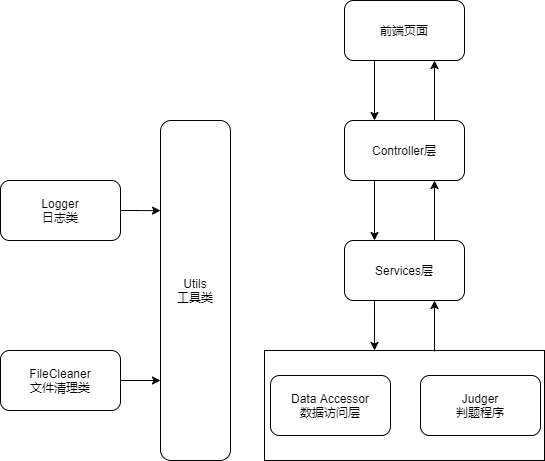

如图为本项目架构图，前端页面直接与后端Controller进行交互，Controller层调用Services层提供的服务完成相应功能，Services层调用数据访问层进行数据库访问，调用Judger模块提供的接口完成判题相关功能。

Utils类整合了日志类和文件清理类，为后端整体提供通用工具。

## 项目要求实现方式

### 程序集与模块划分

如上架构图所示，本项目可划分为前端，Controller层，Services层，数据访问层，判题程序，日志类，文件清理类，通用工具类8个模块。

其中前端，Controller层，Services层构成一个程序集，作为整个项目的入口程序，其他5个模块分别作为一个程序集，输出为dll或exe文件供其他模块调用。

满足了项目要求中关于程序集数目和模块划分的要求。

### Win32 dll模块

复用过去实现的C++日志代码，将其输出为dll文件，使用互操作方式供c#程序调用。

### COM组件

使用Visual Studio2019创建ATL项目，使用C++编写相应代码，完成一个文件清理类，输出为com组件。

使用程序微软提供的程序TlbImp将com组件转化为可供.net平台使用的类

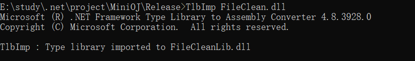

### 共享程序集

由于使用互操作方式调用Win32 dll使用相应功能较为繁琐，因此决定使用c#代码对其重新封装，同时调用文件清理类，加强了日志功能，使之可以清除无用的日志文件。

最终封装为Utils类。

由于该类较为通用，因此我决定将其设置为共享程序集，使用密钥对该项目进行签名后将其注册至全局缓存区中，但由于该类依赖于文件清理类，因此我们需要将文件清理类同时加入全局缓存区中

由于该dll未进行签名，因此我们对dll文件进行反汇编后重新签名编译，再将其注册为共享程序集

具体指令如下图所示：


### C++/CLI程序集

使用C++/Cli实现了判题程序Judger，该类具体实现见下述详细描述

### 多线程技术和线程池技术

* 在Services调用判题程序时使用了Task，使判题工作异步进行，用户花费时间等待
* 实现一个异常处理中间件，使用Task作为返回值，提高异步运行能力

### 利用 ASP.NET、ADO.NET 完成基本页面的处理

* 后端服务器作为Restful 接口服务器，仅用于提供数据，利用ASP.Net完成Restful接口服务器的实现

### .NET 其他技术

* 在判题程序集中使用进程库Process调用外部可执行程序
* 使用中间件统一处理程序异常（其中包括自己编写的可处理异常）

## 判题模块 Judger

* 以**ProblemInfo**类作为输入，该类存储了用户源码，问题信息以及语言信息

  ```c++
  public ref class ProblemInfo
  {
  	public:
  		Int32 max_time;				//单位为Mb
  		Int32 max_mem;				//单位为ms
  		String^ code;				
  		String^ test_case;
  		String^ right_result;
  		Language language;
  		String^ uuid;				//标识本次提交
  };
  ```

* 使用**JudgeResult**输出运行结果

  ```c++
  public ref class JudgeResult
  {
  	public:
  		int time;
  		int memory;
  		JudgeStatus status;
  };
  ```

  

* 对各种判题结果及运行状态定义了相应枚举类**JudgeStatus**

  * WrongAnswer：输出错误
  * Accept：代码正确
  * TimeLimitError：时间超限
  * RuntimeError：运行时错误
  * MemoryLimitError：内存程序
  * CompileError：编译错误
  * SystemError：OJ系统出现错误
  * Waiting：等待提交至线程运行判题程序
  * Running：判题程序运行中

**运行流程**

1. 使用Process库调用外部编译程序对源代码进行编译，C语言代码使用gcc，C++代码使用g++，Java代码使用javac，编译失败直接返回CompileError状态

2. 使用Process库调用已编译成功的代码程序，重定向输入输出，将测试用例作为输入

3. 在用户代码程序运行时使用Process类提供的属性进行监控用户程序内存和时间使用情况，当超出内存或时间限制时，调用kill函数直接中断
4. 检测程序是否时间超限，内存超限或异常退出，若是，返回相应状态
5. 获取程序的重定向输出，与该问题的预计输入进行比对（去除首末空白符以及'\r'），若结果相同，返回Accept状态，反之，返回WrongAnswer状态

## 数据访问层模块DataAccessor

该模块定义了程序使用各个实体类，并提供一系列数据访问方法，使用第三方库dapper完成对数据的访问

### 数据库表结构

#### User

| 属性     | 类型    | 描述                        |
| -------- | ------- | --------------------------- |
| user_id  | int     | 用户编号                    |
| nickname | varchar | 用户名                      |
| password | varchar | 用户密码（使用md5加密处理） |

#### Problem

| 属性       | 类型    | 描述                 |
| ---------- | ------- | -------------------- |
| problem_id | int     | 问题编号             |
| title      | varchar | 问题标题             |
| max_time   | int     | 最大时限，以ms为单位 |
| max_memory | int     | 最大内存，以KB为单位 |

#### Submission

| 属性          | 类型     | 描述                               |
| ------------- | -------- | ---------------------------------- |
| submission_id | int      | 提交记录编号                       |
| user_id       | int      | 提交者用户编号                     |
| problem_id    | int      | 提交问题用户编号                   |
| status        | varchar  | 提交记录状态                       |
| code          | text     | 提交代码                           |
| time          | int      | 消耗时间，以ms为单位               |
| memory        | int      | 消耗内存，以KB为单位               |
| language      | varchar  | 编程语言                           |
| Uuid          | varchar  | 程序生成的uuid，用于临时文件的处理 |
| CreateTime    | datetime | 提交时间                           |

### 实体类

下面各实体类在以数据库表结果为基础的前提下完成的，但进行了相应处理，隐藏了部分不应向用户展示的内容以及动态生成部分信息

* User

  ```c#
      public class User
      {
          public int UserId { get; set; }
          public string Nickname { get; set; }
          public int SolvedNumber { get; set; }
          public User()
          {
              UserId = -1;
          }
      }
  ```

  该类存放用户相应信息，其中，由于密码信息较为敏感，未避免出错，不存放在该实体类中

* Problem

  ```c#
      public class Problem
      {
          public int ProblemId { get; set; }
          public string Title { get; set; } = null;
          public int MaxTime { get; set; }
          public int MaxMemory { get; set; }
      }
  ```

  该类存放了问题的相应信息，其中问题内容，测试用例以及预计输出存放于文件系统中，系统根据问题名生成相应目录及文件

* Submission

  ```c#
      public class Submission
      {
          public int SubmissionId { get; set; }
          public int UserId { get; set; }
          public int ProblemId { get; set; }
          public string Uuid { get; set; }
          public string Code { get; set; }
          public string Lang { get; set; }
          public string Status { get; set; }
          public string CreateTime { get; set; }
          public int Memory { get; set; }
          public int Time { get; set; }
          public string NickName { get; set; }
          public string Title { get; set; }
      }
  ```

  该类定义了用户某次提交记录的一系列信息

### 提供方法

该模块提供了一系列API用于系统对相应数据的访问

* UserDao

  ```c#
  // 根据用户名获取用户信息
  static public User SearchUser(string nickname);
  // 检测该用户名是否重复
  static public bool IfNicknameExist(string nickname);
  // 添加新用户
  static public bool AddUser(string nickname, string password);
  // 获取用户列表
  static public List<User> GetUsers(int start_from, int length);
  // 检测密码是否正确
  static public User CheckPassword(string nickname, string password);
  ```

* ProblemDao

  ```c#
  // 检测该问题标题是否存在
  static public bool IfProblemExists(string title);
  // 添加新问题
  static public bool AddProblem(Problem problem);
  // 获取问题列表
  static public List<Problem> GetProblems(int start_from,int length);
  // 获取问题信息
  static public Problem GetProblem(string title);
  ```

* SubmissionDao

  ``` c#
  // 添加新提交记录
  static public bool AddSubmission(Submission submission);
  // 设置提交状态
  static public bool SetResult(Submission submission);
  // 修改提交记录状态
  static public bool ChangeSubmissionStatus(Submission submission);
  // 获取所有人提交记录
  static public List<Submission> GetSubmissions(int start_from, int length);
  // 获取某位用户提交记录
  static public List<Submission> GetSubmissionsByOne(string nickname, int start_from, int length);
  ```

## Service模块

该模块通过Judger模块和DataAccessor模块完成程序的具体逻辑部分，供Controller模块调用

### UserServices类

用于提供与用户相关的一系列功能

* 用户注册

  ```c#
  public static User SignUp(string nickname,string password);
  ```

  使用md5算法对密码进行加密后存入数据库

* 用户登录

  ```c#
  public static User SignIn(string nickname,string password);
  ```

  判断用户密码是否正确，密码同样在该方法中使用md5处理

* 检测用户名是否存在

  ```c#
  public static bool CheckNickname(string nickname);
  ```

* 获取某一用户信息

  ```c#
  public static User GetUser(string nickname);
  ```

* 获取用户列表

  ```c#
  public static List<User>GetUsers(int start_from,int length);
  ```

### ProblemServices类

提供与问题相关的一系列功能

在该服务中，使用如下三种实体类来定义相关信息

``` c#
    // 输入的问题信息
	// 相关的文件内容使用IFormFile存储
	public class InputProblemInfo
    {
        public Problem SimpleInfo { set; get; }
        public IFormFile Content { get; set; }
        public IFormFile TestCase { get; set; }
        public IFormFile RightResult { get; set; }
    }
	// 对外输出的问题信息
	// 相关的文件内容使用string存储
    public class OutputProblemInfo
    {
        public Problem SimpleInfo { set; get; }
        public string Content { get; set; }
        public string TestCase { get; set; }
        public string RightResult { get; set; }
    }
	
	// 定义于DataAccessor模块中的实体类
	// 用于对于数据库内的实体模型
	public class Problem
    {
        public int ProblemId { get; set; }
        public string Title { get; set; } = null;
        public int MaxTime { get; set; }
        public int MaxMemory { get; set; }
    }
```

* 添加问题

  ```c#
  public static void AddProblem(InputProblemInfo info);
  ```

  从info中读取问题描述，测试用例，预计输出三个文件内容，并将其存放在文件系统中
  之后调用DataAccessor模块的相应接口向数据库内写入数据

* 读取全部问题信息

  ```c#
  public static OutputProblemInfo GetProblemInfoInner(string title);
  ```

  获取包括测试用例和预计输出在内的问题信息，用于向Judger模块提供相关数据

* 获取公开问题信息

  ```c#
  public static OutputProblemInfo GetProblemInfo(string title);
  ```

  获取可展示给用户的问题信息

* 检测问题标题是否存在

  ```c#
  public static bool CheckTitle(string title);
  ```

* 获取问题列表

  ```c#
  public static List<Problem> GetProblems(int start_from, int len);
  ```

### SubmissionServices类

用于提供于代码提交的相关功能

* 提交代码

  ```c#
  public static void Judge(string code, int user_id, string problem_title, string lang);
  ```

  1. 根据输入信息初始化实体类Submission的值，并调用DataAccessor的接口将初始信息存入数据库中，初始提交状态为Waiting

  2. 使用Task异步运行判题功能，Task所调用的匿名函数如下所示

     ```c#
     Task task = new Task(() =>
                   {
                       // 将提交状态改为Running
                       submission.Status = JudgeCore.JudgeStatus.Running.ToString();
                       // 修改数据库内相应数据
                       SubmissionDao.ChangeSubmissionStatus(submission);
                       var simple_info = info.SimpleInfo;
                       // 设置判题信息
                       JudgeCore.ProblemInfo judge_info = new JudgeCore.ProblemInfo()
                       {
                           code = submission.Code,
                           max_mem = simple_info.MaxMemory,
                           max_time = simple_info.MaxTime,
                           uuid = uuid,
                           right_result = info.RightResult,
                           test_case = info.TestCase,
                           language = l
                       };
                       // 调用Judger模块接口开始判题
                       var result = JudgeCore.Judger.judge(judge_info);
                       // 获取结果
                       submission.Status = result.status.ToString();
                       submission.Time = result.time;
                       submission.Memory = result.memory;
                       // 将结果存入数据库中
                       SubmissionDao.SetResult(submission);
                   });
     ```

* 获取所有提交记录

  ```c#
  public static List<Submission> GetSubmissions(int start_from,int len);
  ```

* 获取某人提交记录

  ```c#
  public static List<Submission> GetSubmissions(string nickname,int start_from,int len);
  ```

* 过滤提交记录中的代码

  ```c#
  public static void SubmissionsFilter(List<Submission> submissions,int? user_id);
  ```

  本程序设计为用户不可查看非自己的提交记录中的代码
  因此调用该方法，将提交者用户编号不等于输入参数`user_id`的记录中的`code`属性设为null

## Controller模块

提供Restful API，直接与前端进行交互

### 结果实体类

用于包装相应结果信息，并返回给前端

具体定义如下，分为携带数据和不携带数据两种类型

```c#
    public class Result
    {
        public bool IsSuccess { set; get; } = true;
        public string Message { set; get; } = "Sucess";
    }

    public class Result<T> : Result
    {
        public T Data { set; get; }
        public Result(T data)
        {
            Data = data;
        }
        public Result() : base()
        {

        }
    }
```


### UserController类

**Attribute**

```c#
[ApiController]
[Route("/api/[controller]")]
```

* 注册

  ```c#
  [HttpPost("SignUp")]
  public Result SignUp([FromForm] SignInInfo signInInfo);
  ```

* 登录

  ```c#
  [HttpPost("SignIn")]
  public Result SignIn([FromForm]SignInInfo signInInfo);
  ```

  使用session存储登录信息

* 获取用户列表

  ```c#
  [HttpGet("GetUsers/{start_from}/{length}")]
  public Result<List<User>> GetUsers(int start_from,int length);
  ```

* 获取某用户信息

  ```c#
  [HttpGet("GetUser/{nickname}")]
  public Result<User> GetUser(string nickname);
  ```

* 获取用户自身信息

  ```c#
  [HttpGet("GetMe")]
  public Result<User> GetMe();
  ```

  根据储存在session中的用户信息返回相应结果

* 检测登录状态

  ```c#
  [HttpGet("CheckSignInStatus")]
  public Result CheckSiginInStatus();
  ```

  检测session中的相应信息判断用户是否登录

* 登出

  ```c#
  [HttpPost("Logout")]
  public Result Logout();
  ```

  清除session

### ProblemController类

**Attribute**

```c#
[Route("api/[controller]")]
[ApiController]
```

* 添加问题

  ```c#
  [HttpPost("AddProblem")]
  public Result AddProblem();
  ```

  处理相应输入数据，并调用ProblemServices完成添加问题功能

* 获取问题列表

  ```c#
  [HttpGet("GetProblems/{start_from}/{len}")]
  public Result<List<Problem>> GetProblems(int start_from,int len);
  ```

* 获取某问题信息

  ```c#
  [HttpPost("GetProblem")]
  public Result<OutputProblemInfo> GetProblem([FromForm]string title);
  ```

### SubmissionController类

**Attribute**

```c#
[Route("api/[controller]")]
[ApiController]
```

* 判题

  ```c#
  [HttpPost("Judge")]
  public Result Judge([FromForm] JudgeInfo info);
  ```

* 获取所有提交记录

  ```c#
  [HttpGet("GetSubmissions/{start_from}/{len}")]
  public Result GetSubmissions(int start_from,int len);
  ```

  先调用相关API获取提交记录，在对记录进行过滤，屏蔽其他用户的代码

* 获取某用户提交记录

  ```c#
  [HttpGet("GetSubmissionsByMe/{start_from}/{len}/{nickname}")]
  public Result GetSubmissionsByMe(int start_from,int len,string nickname);
  ```

  执行逻辑与上述一致

## 异常处理中间件

### 自定义异常

本程序中，我们针对可能发生的异常状态定义了一系列异常，并统一交由一个异常处理中间件进行处理，将异常包装为返回前端的Result类

自定义的异常类的基类为`MyException`，该异常类继承自`Exception`，拥有一个Result类型的属性，作为返回前端的数据

```c#
    public class MyException: Exception
    {
        public Result Result { get; protected set; }
    }
```


同时我们定义了两个子类，分别对应我们已知在程序中出现的可处理异常以及未知的异常

下面为已知异常`UserException`类

```c#
    public class UserException : MyException
    {
        public enum Type
        {
            NickExists,AlreadySignIn,NotSiginIn,ProblemExists,InputError
        }
        public UserException(Type type)
        {
            Result = new Result { IsSuccess = false, Message = GetMessageFromType(type)};
        }
        private string GetMessageFromType(Type type)
        {
            switch (type)
            {
                case Type.NickExists:
                    return "Nickname already exists";
                case Type.AlreadySignIn:
                    return "Already sign in";
                case Type.NotSiginIn:
                    return "Please sigin in";
                case Type.ProblemExists:
                    return "The problem title is used";
                case Type.InputError:
                    return "The input is wrong";
                default:
                    return "Unknow exception";
            }
        }
    }
```

分别针对用户名已存在，用户已登录等情况设置相应信息

对于其他异常，则定义MySystemException来表示

```c#
    public class MySytemException: MyException
    {
        public MySytemException()
        {
            Result = new Result { IsSuccess = false, Message = "System Error" };
        }
    }
```


### 中间件

异常处理类如下所示，使用try-catch语句异步执行_next代理，当执行到后续函数出现异常时，则进行捕获，先对`UserException`异常进行捕获，之后捕获`MySystemException`，最后捕获剩余全部异常，输出至错误日志中，并用`MySystemException`进行替代处理

捕获异常之后，将异常交予异常处理方法`HandleExceptionAsync`进行处理，将结果写入response中返回给前端

```c#
    public class ErrorHandler
    {
        private readonly RequestDelegate _next;
        public ErrorHandler(RequestDelegate next)
        {
            _next = next;
        }
        public async Task Invoke(HttpContext context)
        {
            try
            {
                await _next.Invoke(context);
            }
            catch (MyException ex)
            {
                await HandleExceptionAsync(context, ex);
            }
            catch (Exception e)
            {
                Utils.Logger.GetInstance().Error(e.Message);
                await HandleExceptionAsync(context, new MySytemException());
            }
        }
        private async Task HandleExceptionAsync(HttpContext context, MyException exception)
        {
            Utils.Logger.GetInstance().Log(exception.Message);
            var response = context.Response;
            response.ContentType = "application/json";
            response.StatusCode = (int)HttpStatusCode.InternalServerError;
            response.StatusCode = 200;
            await new JsonResult(exception.Result).ExecuteResultAsync(new ActionContext
            {
                HttpContext = context,
            });
        }
    }
```

## 前端模块

* 使用bootstrap作为前端样式框架

* 使用knockout.js进行数据绑定
* 使用gulp进行前端页面构建，实现组件复用

## 运行截图

### 主页

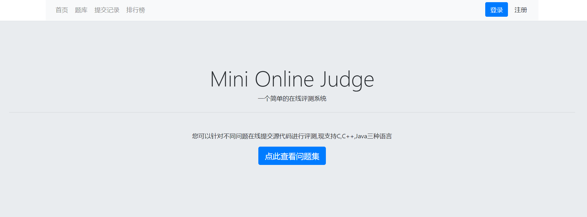

### 登录页面

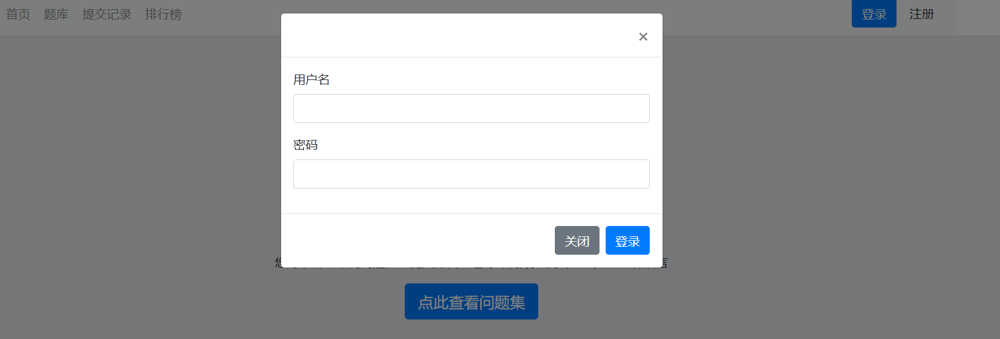

### 注册页面

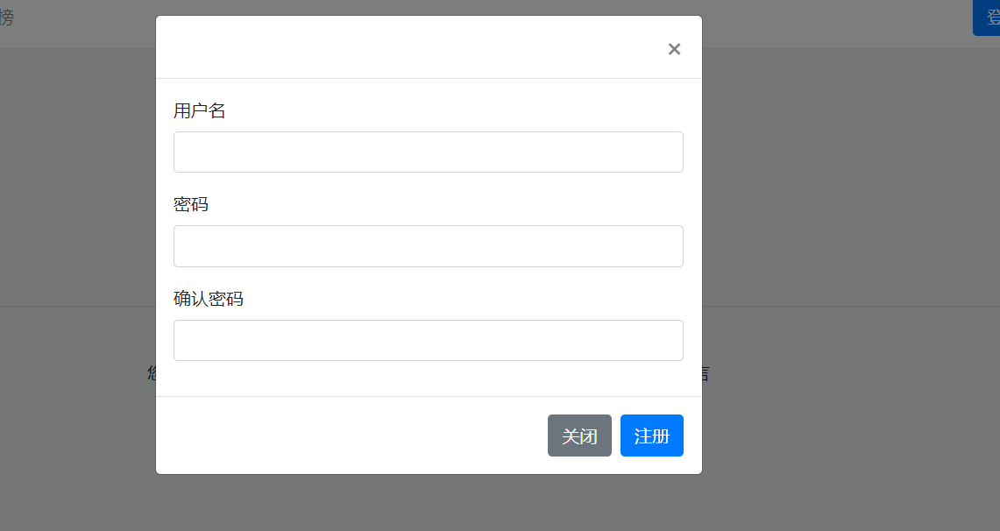

### 个人主页

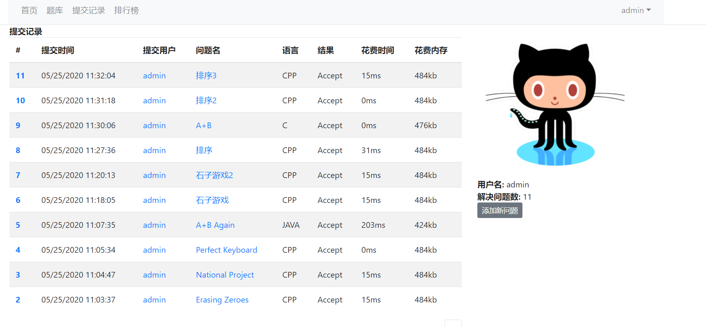

### 添加新问题

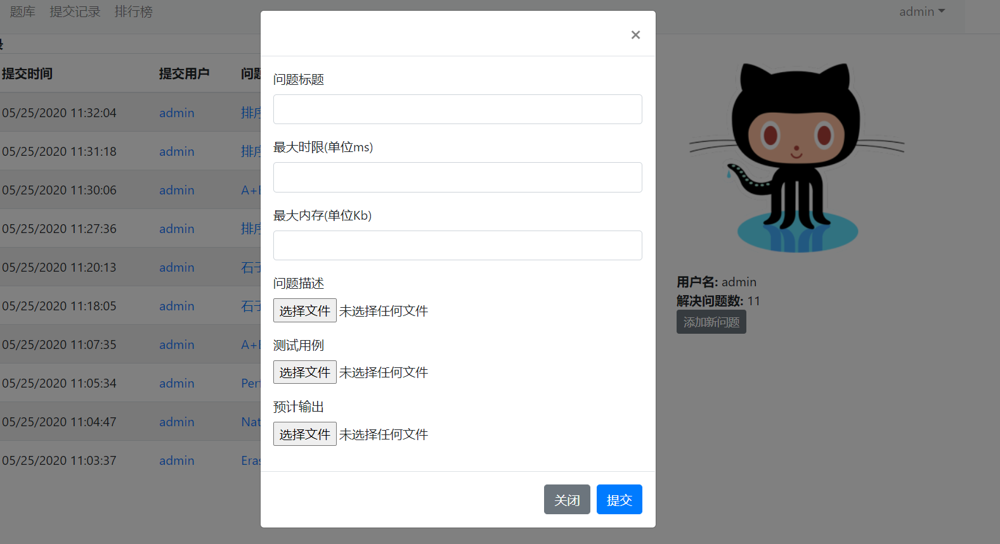

### 查看排行榜

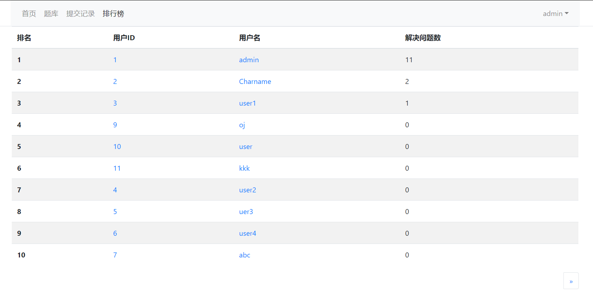

### 查看问题列表

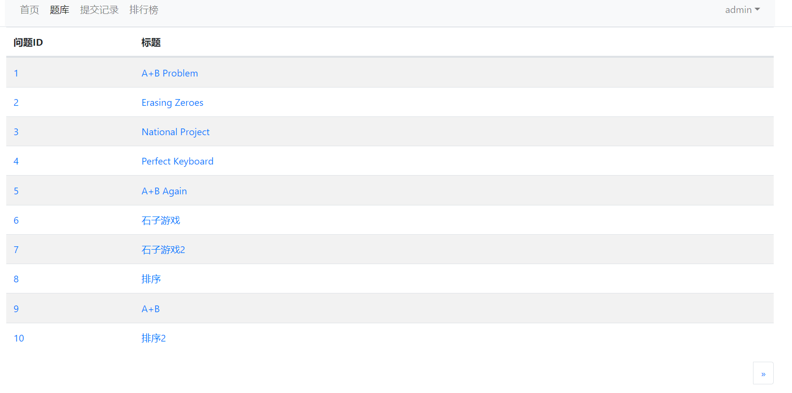

### 问题详情页

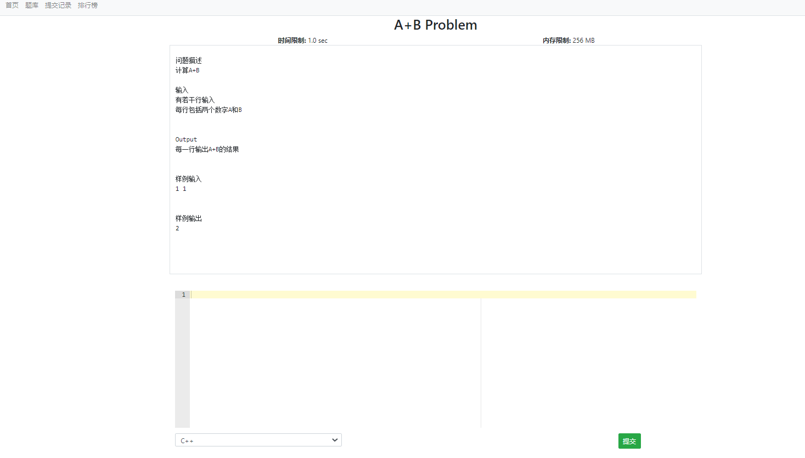

### 查看提交记录

**提交记录列表**

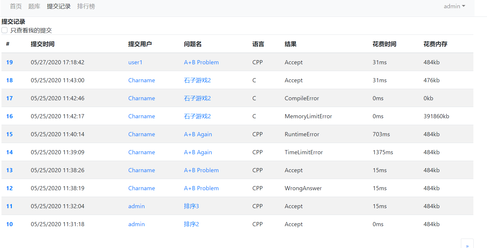

**个人提交代码**

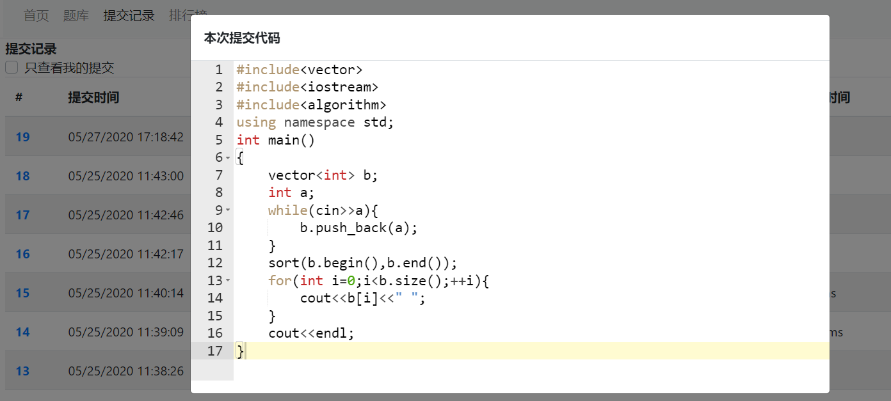

**他人提交代码**

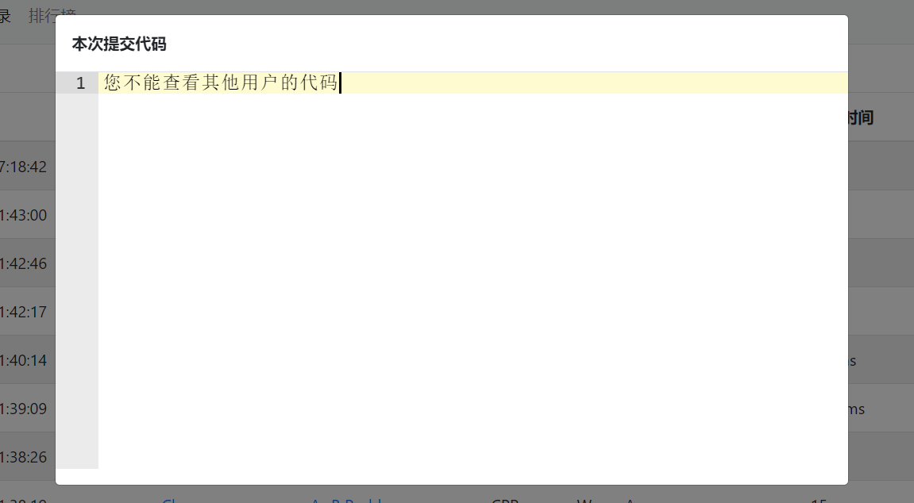